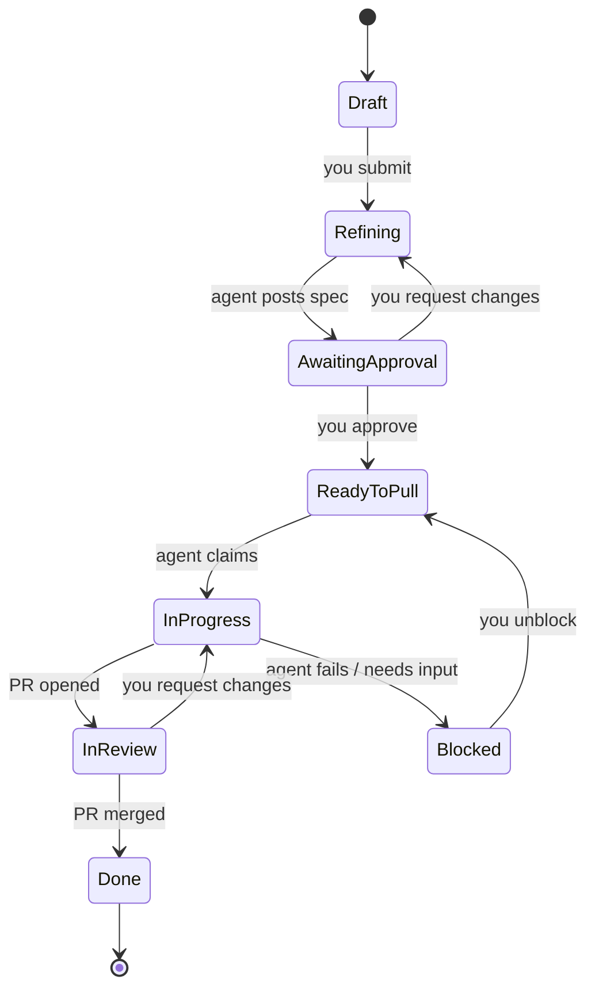
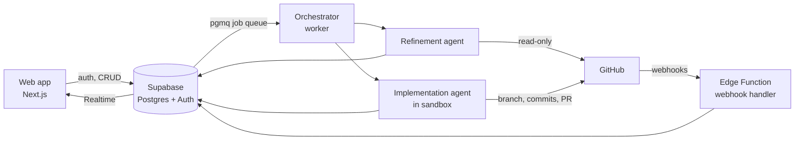
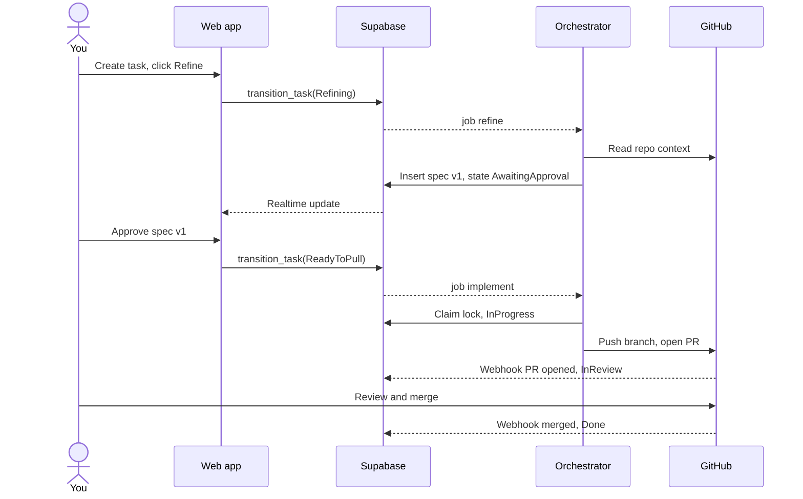

# AI-Driven PM System — High-Level Design

_Version 1 · 2026-09-21_

## Overview

The system is a single-user, Jira-like board where you write tasks, a refinement agent turns them into specs, you approve, and an implementation agent opens a pull request on GitHub. Supabase is the single source of truth for tasks, specs, agent runs and audit history; GitHub is the source of truth for code.

**Goals**

- Human-in-the-loop by design: no code is written until you approve a spec, and nothing merges without your review.
- Every agent action is traceable: which run, which prompt version, which tokens, which commits.
- Cheap and simple to operate as a personal project (free/low tiers, no Kubernetes).
- Extensible: new agent types (reviewer, tester, docs writer) plug into the same run model.

**Non-goals (v1)**

- Multi-tenant SaaS, teams, permissions beyond you.
- Sprints, burndown charts, time tracking.
- Auto-merge to main.

**Assumptions**

- One user (you), a handful of repositories, tens of tasks per week.
- Agents run on Claude via the Claude Agent SDK (or Claude Code in headless mode); the model provider is swappable behind an adapter.
- Each task targets exactly one repository and results in one branch + one PR.

**v1 deployment**: everything runs on your home computer (localhost) — the Next.js app, the orchestrator and a local Docker sandbox — connected to hosted Supabase, GitHub and the model API.

## Task lifecycle

A task moves through nine states, with two human gates: approving the spec and reviewing the PR. Agents may only perform the transitions marked as agent-owned; the database enforces this.

| State | Owner | Exit condition |
| --- | --- | --- |
| Draft | You | You click "Refine" |
| Refining | Refinement agent | Spec version posted |
| AwaitingApproval | You | Approve, or comment and send back |
| ReadyToPull | Queue | Implementation agent claims it (atomic lock) |
| InProgress | Implementation agent | PR opened, or failure after N retries |
| Blocked | You | You answer the agent's question or edit the spec |
| InReview | You | PR merged (webhook) or changes requested |
| Done | — | Terminal |

Key rule: approval is pinned to a specific spec version. If the spec changes after approval, the task drops back to AwaitingApproval.

## Architecture

The design is event-driven around Supabase: the web app writes state, database changes enqueue jobs, and a worker picks them up. Agents never talk to the UI directly; they read and write through the same database and API.

| Component | Responsibility | Runs on |
| --- | --- | --- |
| Web app | Board, task editor, spec review/diff, approvals, live run logs | Your home computer (localhost) in v1; Vercel or similar later |
| Supabase Postgres | Tasks, specs, runs, events; RLS; state-transition guards | Supabase |
| Supabase Realtime | Push task/run updates to the board without polling | Supabase |
| Job queue (pgmq) | Durable jobs: `refine`, `implement`, `address_review` | Supabase Postgres extension |
| Orchestrator | Dequeues jobs, enforces concurrency and budgets, launches agents, handles retries | Next.js process on your home computer in v1; extractable to its own worker later |
| Refinement agent | Reads repo context, writes spec + tech suggestions | Inside orchestrator process |
| Implementation agent | Clones repo, codes, runs tests, pushes branch, opens PR | Ephemeral Docker container per task (local Docker in v1) |
| Webhook handler | Receives PR/review/merge/CI events, updates task state | Supabase Edge Function |
| GitHub App | Scoped repo access, short-lived tokens | GitHub |

The orchestrator lives inside the Next.js backend behind its own module boundary (`packages/orchestrator`), so extracting it later is a move, not a rewrite. Agent runs last minutes to tens of minutes, so the app must run as a long-lived Node server (v1: `next start` on your home computer; later Railway, Fly.io or a VPS) rather than serverless or Edge Functions, which have short execution limits.

Localhost works because nothing needs to call into your machine: GitHub webhooks land on the hosted Supabase Edge Function, and the local worker pulls jobs from pgmq. Runs only progress while the computer is on; queued jobs wait safely until it is. Extract the orchestrator into its own worker once runs start slowing the UI or you want more than 1–2 concurrent runs.

## Agents

Two agents share one run framework: each run has an input snapshot, a versioned system prompt, a tool allow-list, a token/time budget, and a structured output validated against a JSON schema before it touches the database.

**Refinement agent (read-only)**

- Input: task title/description, target repo, prior spec versions and your comments.
- Tools: read files, search code, list dependencies, read README/ADRs, web search for library docs. No write access anywhere.
- Output (JSON schema): problem statement, acceptance criteria, proposed approach, technology suggestions with rationale and alternatives, affected files, risks, open questions, estimate (S/M/L), and a test plan.
- If it has open questions it cannot resolve, it still posts the spec but flags them; you answer inline and re-run.

**Implementation agent (sandboxed, write to branch only)**

- Input: the approved spec version (immutable), repo, base branch.
- Environment: fresh local Docker container per task with the repo cloned, a short-lived GitHub App token scoped to that repo, and network restricted to GitHub, package registries and the model API.
- Loop: plan → edit → run tests/lint → fix → commit. Push to `agent/<task-key>-<slug>`, open a PR linking the task and embedding the spec's acceptance criteria as a checklist.
- Guardrails: cannot push to protected branches, cannot change CI config or secrets files, stops at budget and moves the task to Blocked with a summary.
- Review loop: when you request changes on the PR, a webhook enqueues `address_review`; the agent pushes follow-up commits to the same branch.

**Suggested runtime**

Use the Claude Agent SDK for both agents: it gives you the agent loop, file/bash tools, permission hooks and MCP support, so you write prompts, schemas and guardrails rather than the loop itself. Keep a thin `AgentRunner` interface so you can swap in another provider later.

**Later agents on the same framework**: PR reviewer, test writer, changelog/docs writer, and a triage agent that splits large tasks into subtasks.

## Data model (Supabase)

Eight core tables cover v1; specs and runs are append-only so you always have history. State transitions go through one Postgres function, `transition_task(task_id, to_state, actor)`, which validates the move, writes an event and enqueues the next job in a single transaction.

| Table | Key columns | Notes |
| --- | --- | --- |
| `projects` | id, name, repo_owner, repo_name, default_branch, github_installation_id | One project per repository |
| `tasks` | id, project_id, key (e.g. PM-42), title, description, state, priority, labels[], approved_spec_id, branch, pr_number, locked_by, locked_at | `state` is an enum; `approved_spec_id` pins the approved version |
| `task_specs` | id, task_id, version, content jsonb, created_by_run_id, created_at | Immutable; new version on every refinement |
| `comments` | id, task_id, spec_id?, author (user/agent), body, created_at | Your feedback on specs and agent questions |
| `agent_runs` | id, task_id, kind (refine/implement/address_review), status, prompt_version, model, input_snapshot jsonb, output jsonb, tokens_in, tokens_out, cost_usd, started_at, finished_at, error | One row per attempt |
| `run_logs` | id, run_id, seq, level, message, payload jsonb | Streamed to UI via Realtime |
| `task_events` | id, task_id, from_state, to_state, actor, reason, created_at | Audit trail |
| `github_events` | delivery_id (unique), type, payload jsonb, processed_at | Idempotent webhook ingestion |

**Supabase features used**

- Auth: GitHub OAuth login for you; RLS policies restrict all rows to your user id.
- Realtime: board and run-log live updates.
- pgmq (Queues): durable job queue with visibility timeouts, so a crashed worker's job is retried.
- Storage: run artifacts (full transcripts, test output, diffs) to keep large blobs out of Postgres.
- Secrets: v1 keeps the GitHub App key and model API key in `.env.local` on your computer; Supabase Vault is the option once the worker moves to the cloud.
- Stale-lock sweeping: done by the orchestrator in v1; pg_cron is the option once it runs elsewhere.

## GitHub integration

Use a private GitHub App rather than a personal access token: it gives per-repo installation, fine-grained permissions, short-lived tokens (1 hour) and a single webhook endpoint.

**App permissions**

- Contents: read & write (branches, commits)
- Pull requests: read & write
- Issues: read (optional, for importing issues as tasks)
- Checks / commit statuses: read (to know if CI passed)
- Metadata: read

**Webhooks consumed**

| Event | Effect in the PM system |
| --- | --- |
| `pull_request.opened` | Link PR to task, move to InReview |
| `pull_request_review` (changes requested) | Enqueue `address_review`, move to InProgress |
| `pull_request.closed` + merged | Move to Done |
| `pull_request.closed` not merged | Move to Blocked with reason |
| `check_suite.completed` | Show CI status on the card; failure can trigger one auto-fix attempt (later) |
| `issues.opened` (optional) | Create a Draft task |

**Conventions**

- Branch: `agent/PM-42-short-slug`; PR title `[PM-42] <task title>`; PR body links back to the task.
- Webhook handler verifies the signature, stores the raw event in `github_events` keyed by delivery id (dedupe), then calls `transition_task`.
- Protect `main` with branch protection requiring your review, so even a misbehaving agent cannot merge.

## Key flow: idea to merged PR

The happy path takes two clicks from you (approve spec, approve PR); everything else is queued work.

**Failure handling**

- Worker crash: pgmq visibility timeout re-delivers the job; the lock sweeper frees stale locks.
- Agent fails tests after budget: task goes to Blocked with the agent's summary and the partial branch kept for inspection.
- Duplicate webhooks: ignored via unique `delivery_id`.
- Spec edited after approval: approval voided, task returns to AwaitingApproval.

## Security, cost and observability

The biggest risks are an agent doing something destructive with repo access and runaway model spend; both are capped by design.

**Security**

- Agents run in throwaway local Docker containers with no host mounts and an egress allow-list.
- GitHub tokens are minted per run, scoped to one repo, and expire in an hour.
- Secrets stay server-side (`.env.local`, Edge Function secrets); the browser only ever holds your user JWT, never the service role key.
- Treat repo content, issue text and web pages as untrusted input to the agent (prompt injection); the tool allow-list and branch protection are the real safety net, not the prompt.

**Cost control**

- Per-run token and wall-clock budgets; per-day spend cap checked by the orchestrator before starting any run.
- Concurrency limit (v1: one implementation run at a time).
- Use a cheaper model for refinement and a stronger one for implementation; record `cost_usd` on every run.

**Observability**

- Live run log per task in the UI (Realtime on `run_logs`).
- Full transcripts in Supabase Storage for debugging prompts.
- A simple dashboard view: runs per day, success rate, average cost per task, time in each state.

## Tech stack and roadmap

One TypeScript codebase end to end keeps a personal project manageable: shared types between UI, worker and Edge Functions.

| Layer | Choice (v1) | Alternative / later |
| --- | --- | --- |
| Frontend | Next.js + Tailwind + shadcn/ui, dnd-kit for the board | SvelteKit |
| Backend data | Supabase (Postgres, Auth, Realtime, Storage, pgmq) | — |
| Webhooks | Supabase Edge Functions (Deno) | Next.js API route (needs a public URL) |
| Orchestrator | Node.js module inside the Next.js backend, running on your home computer against hosted Supabase | Standalone Node worker on Fly.io / Railway / home server |
| Agents | Claude Agent SDK (TypeScript) | Claude Code headless in the container |
| Sandbox | One Docker container per implementation run on local Docker (no host mounts, no access to your SSH keys or credentials) | E2B / Daytona managed sandboxes (if runs move to the cloud) |
| GitHub | GitHub App + Octokit | — |
| Validation | Zod schemas for agent outputs | — |

**Phased roadmap**

1. **Board MVP**: Supabase schema, auth, board, task editor, `transition_task`.
2. **Refinement agent**: queue + orchestrator, read-only repo access, spec versions and approval UI with diff between versions.
3. **Implementation agent**: sandbox, branch + PR creation, webhooks for PR lifecycle.
4. **Review loop**: `address_review` on changes requested, CI status on cards, sandbox egress proxy.
5. **Polish**: cost dashboard, subtasks/triage agent, GitHub issue import, CI auto-fix.

**Decisions**

- Decided: v1 runs on your home computer (localhost) against hosted Supabase; revisit cloud hosting when you want runs while it is off.
- Decided: the implementation sandbox is a local Docker container.

**Open questions**

- [ ] Should the implementation agent be allowed to add new dependencies without asking, or must those be in the approved spec?
- [ ] One repo per task, or do you need tasks that span repos?
- [ ] Is a monthly spend cap needed from day one, and at what amount?
