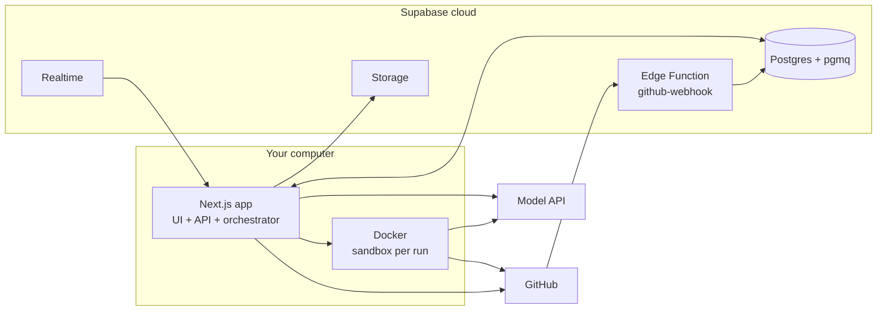

# AI-Driven PM System — Low-Level Design (v1)

_Version 1 · 2026-09-21 · Companion to `HLD.md`; task breakdown in `TASKS.md`_

## 1. Scope and v1 topology

This LLD turns the HLD into buildable units: one Next.js app on localhost, hosted Supabase, a GitHub App, the model API, and one local Docker container per implementation run. Every section ends in something you can code directly: DDL, TypeScript interfaces, route signatures or a checklist.



**In scope for v1**: single user, board, task CRUD, refinement agent, spec approval, implementation agent, PR lifecycle via webhooks, review-comment follow-ups, cost tracking.

**Deferred**: CI auto-fix, triage agent, issue import, cloud deployment, multiple concurrent implementation runs (v1 = 1 at a time).

## 2. Repository layout

One pnpm monorepo with one app and small shared packages; the orchestrator is a package the Next.js app starts, so extracting it into its own process later means adding a second entrypoint only.

```text
pm-agent/
├─ apps/
│  └─ web/                     # Next.js 16 (App Router)
│     ├─ app/
│     │  ├─ (board)/page.tsx        # Kanban board
│     │  ├─ tasks/[key]/page.tsx    # Task detail, spec review, runs
│     │  ├─ settings/page.tsx       # Projects, budgets, GitHub install
│     │  └─ api/…                   # Route handlers (see §10)
│     ├─ instrumentation.ts         # Starts orchestrator on server boot
│     └─ lib/supabase/{server,browser}.ts
├─ packages/
│  ├─ db/            # Generated Supabase types, typed query helpers
│  ├─ domain/        # TaskState enum, transition table, Zod schemas
│  ├─ orchestrator/  # Worker loop, job handlers, budgets, locks
│  ├─ agents/        # AgentRunner, refinement + implementation agents, prompts/
│  ├─ github/        # GitHub App auth, Octokit wrappers
│  └─ sandbox/       # Docker lifecycle (dockerode)
├─ sandbox-image/
│  ├─ Dockerfile     # Agent runtime image
│  └─ entrypoint/    # Node script that runs the Agent SDK inside the container
├─ supabase/
│  ├─ migrations/    # SQL (schema, RLS, functions, queues)
│  ├─ functions/github-webhook/index.ts
│  ├─ tests/         # pgTAP
│  └─ seed.sql
└─ turbo.json, pnpm-workspace.yaml, .env.example
```

| Package | Depends on | Must not depend on |
| --- | --- | --- |
| `domain` | zod | anything else (pure) |
| `db` | domain, @supabase/supabase-js | orchestrator, agents |
| `github` | domain, octokit | db |
| `sandbox` | dockerode | db, agents |
| `agents` | domain, github, sandbox, Claude Agent SDK | db (receives a `RunContext` instead) |
| `orchestrator` | all of the above | Next.js |
| `apps/web` | db, domain, orchestrator | agents directly |

The orchestrator starts from `instrumentation.ts` only when `ORCHESTRATOR_ENABLED=true` and `NEXT_RUNTIME === 'nodejs'`, so `next dev` hot reloads do not spawn duplicate workers (guard with a `globalThis` singleton).

## 3. Database schema

The schema is one migration, `0001_init.sql`; specs, runs and events are append-only, and `tasks` holds only current state plus pointers.

```sql
create extension if not exists pgmq;

create type task_state as enum (
  'draft','refining','awaiting_approval','ready_to_pull',
  'in_progress','blocked','in_review','done','cancelled');
create type run_kind   as enum ('refine','implement','address_review');
create type run_status as enum ('queued','running','succeeded','failed','cancelled');
create type actor_kind as enum ('user','agent','github','system');

create table projects (
  id uuid primary key default gen_random_uuid(),
  owner_id uuid not null references auth.users(id),
  name text not null,
  key_prefix text not null check (key_prefix ~ '^[A-Z]{2,6}$'),
  repo_owner text not null,
  repo_name text not null,
  default_branch text not null default 'main',
  github_installation_id bigint,                  -- null until the App is installed
  setup_commands text[] not null default '{}',    -- e.g. {'pnpm i'}
  test_commands  text[] not null default '{}',    -- e.g. {'pnpm test','pnpm lint'}
  next_task_number int not null default 1,
  created_at timestamptz not null default now(),
  unique (owner_id, key_prefix)
);

create table tasks (
  id uuid primary key default gen_random_uuid(),
  project_id uuid not null references projects(id) on delete cascade,
  owner_id uuid not null references auth.users(id),
  key text not null unique,                       -- 'PM-42'
  title text not null,
  description text not null default '',
  state task_state not null default 'draft',
  priority smallint not null default 2 check (priority between 0 and 3),
  labels text[] not null default '{}',
  position double precision not null default 0,   -- order within column
  current_spec_id uuid,
  approved_spec_id uuid,
  branch text,
  pr_number int,
  pr_url text,
  locked_by text,                                  -- worker id
  locked_at timestamptz,
  blocked_reason text,
  created_at timestamptz not null default now(),
  updated_at timestamptz not null default now()
);
create index on tasks (project_id, state, position);
create unique index on tasks (project_id, pr_number) where pr_number is not null;

create table task_specs (
  id uuid primary key default gen_random_uuid(),
  task_id uuid not null references tasks(id) on delete cascade,
  version int not null,
  content jsonb not null,            -- validated RefinementOutput
  created_by_run_id uuid,
  created_at timestamptz not null default now(),
  unique (task_id, version)
);
alter table tasks
  add foreign key (current_spec_id)  references task_specs(id),
  add foreign key (approved_spec_id) references task_specs(id);

create table comments (
  id uuid primary key default gen_random_uuid(),
  task_id uuid not null references tasks(id) on delete cascade,
  spec_id uuid references task_specs(id),
  author actor_kind not null,
  body text not null,
  resolved boolean not null default false,
  created_at timestamptz not null default now()
);

create table agent_runs (
  id uuid primary key default gen_random_uuid(),
  task_id uuid not null references tasks(id) on delete cascade,
  kind run_kind not null,
  status run_status not null default 'queued',
  attempt int not null default 1,
  spec_id uuid references task_specs(id),
  prompt_version text not null,
  model text not null,
  input_snapshot jsonb not null,
  output jsonb,
  summary text,
  ci_conclusion text,                -- from check_suite webhooks
  tokens_in int not null default 0,
  tokens_out int not null default 0,
  cost_usd numeric(10,4) not null default 0,
  transcript_path text,              -- Supabase Storage key
  container_id text,
  error text,
  started_at timestamptz,
  finished_at timestamptz,
  created_at timestamptz not null default now()
);
create index on agent_runs (task_id, created_at desc);
create index on agent_runs (created_at) where status = 'succeeded';

create table run_logs (
  id bigint generated always as identity primary key,
  run_id uuid not null references agent_runs(id) on delete cascade,
  seq int not null,
  level text not null check (level in ('debug','info','warn','error')),
  kind text not null,                -- 'text' | 'tool_call' | 'tool_result' | 'status'
  message text not null,
  payload jsonb,
  created_at timestamptz not null default now(),
  unique (run_id, seq)
);

create table task_events (
  id bigint generated always as identity primary key,
  task_id uuid not null references tasks(id) on delete cascade,
  from_state task_state,
  to_state task_state not null,
  actor actor_kind not null,
  reason text,
  created_at timestamptz not null default now()
);

create table github_events (
  delivery_id text primary key,       -- X-GitHub-Delivery
  event text not null,
  action text,
  payload jsonb not null,
  processed_at timestamptz,
  error text,
  received_at timestamptz not null default now()
);

create table settings (
  owner_id uuid primary key references auth.users(id),
  daily_budget_usd numeric(10,2) not null default 10,
  max_concurrent_impl int not null default 1,
  refine_model text not null,
  implement_model text not null
);

create table task_transitions (
  from_state task_state not null,
  to_state   task_state not null,
  actors     actor_kind[] not null,
  primary key (from_state, to_state)
);
```

**RLS**: enable on every table. User-facing tables get `owner_id = auth.uid()` policies (child tables check via a join to `tasks`). `tasks` insert policy also requires `state = 'draft'`. `github_events` and `task_transitions` writes have no user policy; only the service role (Edge Function, orchestrator) touches them. The orchestrator uses the service role key, since it runs server-side only.

**Triggers**

- `tasks_updated_at`: sets `updated_at = now()` on update.
- `tasks_guard_state`: rejects changes to `state`, `approved_spec_id`, `locked_by`, `locked_at`, `pr_number` unless `current_setting('app.transition', true) = 'on'` (set only inside `transition_task`).
- `on_auth_user_created`: inserts a `settings` row for each new user.

**Realtime**: add `tasks`, `task_specs`, `comments`, `agent_runs` and `run_logs` to the `supabase_realtime` publication.

**Storage**: one private bucket, `runs`, with object names `<run_id>/transcript.jsonl`, `<run_id>/diff.patch` and `<run_id>/test-output.txt`. A `select` policy on `storage.objects` lets a user read objects in `runs` only when the first path segment (`(storage.foldername(name))[1]`) is a run on one of their own tasks. There are no user insert, update or delete policies; only the service role writes.

**Migrations workflow**: develop against the local stack (`supabase db reset`, `supabase test db`), then apply to the hosted project with `supabase db push`. Never change the hosted schema by hand.

**Helper function** `create_task(project_id, title, description, priority, labels)`: locks the project row, allocates `key = key_prefix || '-' || next_task_number`, increments the counter and inserts the draft, so keys never collide.

## 4. State machine

All state changes go through `transition_task()`, a `security definer` Postgres function that checks the transition table, updates the task, writes a `task_events` row and enqueues the follow-up job in one transaction. Direct `update tasks set state = …` is blocked by the guard trigger.

| From | To | Allowed actor | Side effect |
| --- | --- | --- | --- |
| draft | refining | user | enqueue `refine` |
| refining | awaiting_approval | agent | set `current_spec_id` |
| refining | blocked | agent | set `blocked_reason` |
| awaiting_approval | refining | user | enqueue `refine` (with your comments) |
| awaiting_approval | ready_to_pull | user | set `approved_spec_id = current_spec_id`; enqueue `implement` |
| ready_to_pull | in_progress | agent | set lock, branch name |
| in_progress | in_review | github, agent | set `pr_number`, `pr_url`; clear lock (agent only as fallback if the webhook is late) |
| in_progress | blocked | agent | clear lock, set reason |
| in_progress | ready_to_pull | system | stale lock released by sweeper; re-enqueue `implement` |
| blocked | ready_to_pull | user | re-enqueue `implement` |
| blocked | refining | user | enqueue `refine` |
| in_review | in_progress | github | enqueue `address_review` |
| in_review | done | github | clear lock |
| in_review | blocked | github | PR closed without merge |
| any except done | cancelled | user | cancel queued/running runs |

```sql
create or replace function transition_task(
  p_task_id uuid,
  p_to task_state,
  p_actor actor_kind,
  p_reason text default null,
  p_patch jsonb default '{}'::jsonb      -- whitelisted keys: branch, pr_number, pr_url,
                                         -- current_spec_id, locked_by, expected_spec_id, review_id
) returns tasks
language plpgsql security definer set search_path = public as $$
declare
  t tasks;
  allowed boolean;
  v_from task_state;
begin
  select * into t from tasks where id = p_task_id for update;
  if not found then raise exception 'task % not found', p_task_id; end if;
  v_from := t.state;

  -- who may call: users act only on their own tasks; non-user actors need the service role
  if p_actor = 'user' and t.owner_id is distinct from auth.uid() then
    raise exception 'not your task' using errcode = '42501';
  end if;
  if p_actor <> 'user' and coalesce(auth.role(), '') <> 'service_role' then
    raise exception 'actor % requires service role', p_actor using errcode = '42501';
  end if;

  select exists (
    select 1 from task_transitions
    where from_state = v_from and to_state = p_to and p_actor = any(actors)
  ) or (p_to = 'cancelled' and v_from not in ('done','cancelled') and p_actor = 'user')
  into allowed;
  if not allowed then
    raise exception 'illegal transition % -> % by %', v_from, p_to, p_actor
      using errcode = 'P0001';
  end if;

  -- approval must pin the spec the user actually looked at
  if v_from = 'awaiting_approval' and p_to = 'ready_to_pull' then
    if t.current_spec_id is null then
      raise exception 'no spec to approve';
    end if;
    if p_patch ? 'expected_spec_id'
       and (p_patch->>'expected_spec_id')::uuid <> t.current_spec_id then
      raise exception 'spec changed since you opened it' using errcode = 'P0002';
    end if;
  end if;

  perform set_config('app.transition', 'on', true);
  update tasks set
    state = p_to,
    approved_spec_id = case when v_from = 'awaiting_approval' and p_to = 'ready_to_pull'
                            then t.current_spec_id else approved_spec_id end,
    branch          = coalesce(p_patch->>'branch', branch),
    pr_number       = coalesce((p_patch->>'pr_number')::int, pr_number),
    pr_url          = coalesce(p_patch->>'pr_url', pr_url),
    current_spec_id = coalesce((p_patch->>'current_spec_id')::uuid, current_spec_id),
    blocked_reason  = case when p_to = 'blocked' then p_reason else null end,
    locked_by = case when p_to = 'in_progress' then coalesce(p_patch->>'locked_by', locked_by)
                     when p_to in ('in_review','blocked','done','cancelled','ready_to_pull') then null
                     else locked_by end,
    locked_at = case when p_to = 'in_progress' then now()
                     when p_to in ('in_review','blocked','done','cancelled','ready_to_pull') then null
                     else locked_at end,
    updated_at = now()
  where id = p_task_id returning * into t;
  perform set_config('app.transition', 'off', true);

  insert into task_events(task_id, from_state, to_state, actor, reason)
  values (p_task_id, v_from, p_to, p_actor, p_reason);

  perform enqueue_for_state(t, v_from, p_patch);   -- maps to_state -> pgmq.send(...)
  return t;
end $$;

revoke all on function transition_task from public, anon;
grant execute on function transition_task to authenticated, service_role;
```

```sql
create or replace function enqueue_for_state(t tasks, p_from task_state, p_patch jsonb)
returns void language plpgsql security definer set search_path = public as $$
begin
  if t.state = 'refining' then
    perform pgmq.send('q_refine', jsonb_build_object(
      'type','refine','taskId',t.id,'requestedAt',now()));
  elsif t.state = 'ready_to_pull' then
    perform pgmq.send('q_implement', jsonb_build_object(
      'type','implement','taskId',t.id,'specId',t.approved_spec_id));
  elsif t.state = 'in_progress' and p_from = 'in_review' then
    perform pgmq.send('q_implement', jsonb_build_object(
      'type','address_review','taskId',t.id,
      'reviewId',(p_patch->>'review_id')::bigint,'prNumber',t.pr_number));
  end if;
end $$;
```

`task_transitions` is seeded in the migration with the table's 14 concrete rows. The "any except done → cancelled" line is a wildcard, so it gets no row; `transition_task` handles it as a special case (the `or (p_to = 'cancelled' …)` clause). This keeps the rules in one place and `packages/domain` mirrors them for the UI (which buttons to show). A Vitest test parses the seed from the migration and asserts both copies match.

**Approval invariant**: inserting a new `task_specs` row while the task is in `ready_to_pull` or later is rejected (trigger on `task_specs`); while in `awaiting_approval` it becomes the new `current_spec_id`, and approval pins whatever is current at click time (guarded by `expected_spec_id`).

## 5. Job queue

Two pgmq queues separate fast, cheap refinement from slow, sandboxed implementation, so a long implementation run never delays a spec. Each message carries only ids; handlers load fresh state from the database and exit early if the task has moved on.

| Queue | Message types | Visibility timeout | Max attempts | Concurrency |
| --- | --- | --- | --- | --- |
| `q_refine` | `refine` | 10 min | 3 | 2 |
| `q_implement` | `implement`, `address_review` | 45 min (extended by heartbeat) | 2 | `settings.max_concurrent_impl` (1) |
| `q_refine_dlq` / `q_implement_dlq` | failed messages | — | — | manual |

```sql
select pgmq.create('q_refine');
select pgmq.create('q_implement');
select pgmq.create('q_refine_dlq');
select pgmq.create('q_implement_dlq');
```

```ts
// packages/domain/src/jobs.ts
export const JobMessage = z.discriminatedUnion('type', [
  z.object({ type: z.literal('refine'),         taskId: z.string().uuid(), requestedAt: z.string() }),
  z.object({ type: z.literal('implement'),      taskId: z.string().uuid(), specId: z.string().uuid() }),
  z.object({ type: z.literal('address_review'), taskId: z.string().uuid(), reviewId: z.number(), prNumber: z.number() }),
]);
export type JobMessage = z.infer<typeof JobMessage>;
```

**Enqueue** happens only in SQL (`enqueue_for_state` inside `transition_task`), so a state change and its job commit together.

**Consume**: pgmq lives in its own schema, which PostgREST does not expose, so the migration adds thin `security definer` wrappers executable only by `service_role`:

```sql
queue_read(p_queue text, p_vt int, p_qty int)
  returns table(msg_id bigint, read_ct int, enqueued_at timestamptz, vt timestamptz, message jsonb)
queue_archive(p_queue text, p_msg_id bigint) returns boolean
queue_set_vt(p_queue text, p_msg_id bigint, p_vt int) returns void
queue_send(p_queue text, p_msg jsonb, p_delay int default 0) returns bigint   -- DLQ moves
```

The worker calls `queue_read`, then `queue_archive` on success. On failure it lets the visibility timeout expire; `read_ct` tells the handler which attempt it is. When `read_ct > max attempts`, the handler sends the message to the DLQ, archives the original and transitions the task to `blocked` with the last error.

**Heartbeat**: long implementation runs call `queue_set_vt(queue, msg_id, 600)` every 2 minutes, so the message only reappears if the worker actually dies.

**Idempotency**: every handler starts with a guard (e.g. `implement` proceeds only if the task is `ready_to_pull` and `approved_spec_id = msg.specId`), so a redelivered message is a no-op.

## 6. Orchestrator

The orchestrator is two polling loops (one per queue) inside the Next.js server process, each with its own concurrency semaphore; it polls every 3 seconds when idle and immediately after finishing a job.

```ts
// packages/orchestrator/src/index.ts
export interface OrchestratorDeps {
  db: ServiceDb;               // service-role Supabase client + typed RPCs
  github: GitHubClientFactory;
  sandbox: SandboxManager;
  agents: { refine: RefinementAgent; implement: ImplementationAgent };
  clock: () => Date;
  log: Logger;
}

export function startOrchestrator(deps: OrchestratorDeps, cfg: { workerId: string }) {
  const refine    = new QueueWorker('q_refine',    handleRefine(deps),    { concurrency: 2, vt: 600,  maxAttempts: 3 });
  const implement = new QueueWorker('q_implement', handleImplement(deps), { concurrency: 1, vt: 2700, maxAttempts: 2, heartbeatSec: 120 });
  refine.start(); implement.start();
  const sweeper = startSweeper(deps, cfg);     // every 60 s
  return { stop: () => Promise.all([refine.stop(), implement.stop(), sweeper.stop()]) };
}
```

**`handleRefine` step by step**

1. Guard: load task; exit unless `state = refining`.
2. Create `agent_runs` row (`kind = refine`, `status = running`, snapshot of task + comments).
3. Mint a read-only installation token; shallow-clone the repo into a temp dir.
4. Run `RefinementAgent.run(ctx)`, streaming events to `run_logs`.
5. On valid output: insert `task_specs` (next version), then `transition_task(→ awaiting_approval, agent, patch {current_spec_id})`.
6. On failure after the last attempt: `transition_task(→ blocked, agent, reason)`.
7. Always: delete temp dir, finalize run tokens/cost, archive the message on success.

**`handleImplement` step by step**

1. Guard: load task; exit unless `state = ready_to_pull` and `approved_spec_id = msg.specId`.
2. Budget check: `sum(cost_usd)` for today + the run's max cost ≤ `daily_budget_usd`, else push the message to next local midnight (`queue_set_vt`) and log a warning on the task.
3. Claim: `transition_task(→ in_progress, agent, patch {branch, locked_by: workerId})`.
4. Create `agent_runs` row (`status = running`, snapshot of spec, prompt version, model).
5. Mint a GitHub installation token scoped to the one repo.
6. Start sandbox container; run `ImplementationAgent.run(ctx)` streaming events to `run_logs`.
7. On success: the agent has committed; orchestrator runs `test_commands` as the final gate, pushes the branch, then opens the PR via Octokit and stores `pr_number`. The webhook moves the task to `in_review`; the handler calls the transition itself if the webhook has not arrived within 30 s.
8. On failure/budget exhaustion: upload transcript, mark run `failed`, `transition_task(→ blocked, agent, reason)`.
9. Always: stop and remove the container, archive the queue message, finalize tokens/cost.

`handleAddressReview` follows steps 4–9 with the existing branch checked out and the review comments as input; it does not open a new PR.

**Sweeper** (every 60 s): tasks `in_progress` with `locked_at` older than 60 min and no running container → back to `ready_to_pull` via a `system` transition; runs stuck in `running` with no log in 15 min → `failed`; containers labelled `pm-agent.*` older than 60 min → removed.

**Cancel**: `POST /api/tasks/:key/cancel` transitions to `cancelled`; the worker holds an `AbortController` per run keyed by task id and aborts it when a Realtime update shows the task as `cancelled`.

**Graceful shutdown**: on SIGTERM stop polling, wait up to 30 s for runs to finish; unfinished runs are left for the sweeper and the queue redelivery.

**Cost accounting**: `cost_usd = tokens_in × in_price + tokens_out × out_price`, with prices in a `model_prices` config map (update it when prices change); cache-read tokens are counted separately if the SDK reports them.

## 7. Agents

Both agents implement one interface and never touch the database; the orchestrator gives them a `RunContext` with an event sink and receives a validated result. Prompts live as versioned files (`packages/agents/prompts/refine.v1.md`), and the version string is stored on every run.

```ts
// packages/agents/src/types.ts
export interface RunContext {
  runId: string;
  task: { key: string; title: string; description: string };
  repo: { owner: string; name: string; defaultBranch: string; token: string };
  budget: { maxTurns: number; maxCostUsd: number; timeoutMs: number };
  emit: (e: AgentEvent) => void;        // -> run_logs
  signal: AbortSignal;                  // cancel from UI
}
export type AgentEvent =
  | { kind: 'text'; message: string }
  | { kind: 'tool_call'; tool: string; input: unknown }
  | { kind: 'tool_result'; tool: string; ok: boolean; summary: string }
  | { kind: 'usage'; tokensIn: number; tokensOut: number };
export interface AgentResult<T> {
  ok: boolean; output?: T; summary: string; error?: string;
  usage: { tokensIn: number; tokensOut: number; model: string };
  transcript: string;                   // JSONL, uploaded to Storage
}
export interface AgentRunner<I, O> {
  run(ctx: RunContext, input: I): Promise<AgentResult<O>>;
}
```

### 7.1 Refinement agent

Runs in the Next.js process against a shallow clone in a temp dir (read-only, no sandbox needed). Tools allowed: `Read`, `Glob`, `Grep`, `WebSearch`, `WebFetch`. No `Bash`, no `Write`/`Edit`.

Input: task text, repo tree summary (top 3 levels), `README`, `package.json`/lockfile names, previous spec version and your unresolved comments.

```ts
// packages/domain/src/spec.ts — RefinementOutput, stored in task_specs.content
export const RefinementOutput = z.object({
  summary: z.string().max(600),
  acceptanceCriteria: z.array(z.string()).min(1).max(15),
  approach: z.string(),                                   // markdown
  techSuggestions: z.array(z.object({
    name: z.string(), purpose: z.string(), rationale: z.string(),
    alternatives: z.array(z.string()), isNewDependency: z.boolean(),
  })),
  affectedFiles: z.array(z.object({
    path: z.string(), change: z.enum(['add','modify','delete']), note: z.string(),
  })),
  testPlan: z.array(z.string()),
  risks: z.array(z.string()),
  openQuestions: z.array(z.string()),
  estimate: z.enum(['S','M','L']),
});
```

The agent returns the JSON as its final message; the runner parses and validates it, and on a validation failure sends one corrective turn with the Zod error before failing the run.

### 7.2 Implementation agent

Runs Claude Code (via the Agent SDK) **inside** the sandbox container; the orchestrator starts the container and executes the agent entrypoint with `docker exec`, streaming stdout JSON events back.

- Tools allowed: `Read`, `Write`, `Edit`, `Glob`, `Grep`, `Bash` (inside the container only).
- Permission hook denies: writes under `.github/`, `.env*`, lockfile changes unless the spec lists a new dependency, `git push` of any kind (the orchestrator pushes), destructive commands outside `/workspace`.
- System prompt includes: the approved spec (acceptance criteria as a checklist), `setup_commands` and `test_commands` from the project, and the rule "commit in small steps; finish only when all test commands pass".
- Completion contract: the agent writes `/workspace/.agent/result.json` with `{ status: 'done' | 'blocked', summary, checklist: [{criterion, met, evidence}], question? }`. The orchestrator reads it, then runs `test_commands` itself as the final gate.
- Push: the orchestrator runs `git push origin agent/<key>-<slug>` inside the container using the installation token injected via a credential helper, then opens the PR.

**address_review** reuses the implementation agent with the PR's review comments and the existing branch checked out; the system prompt says "address only these comments".

**Default budgets (v1)**

| Run kind | Max turns | Max cost | Timeout |
| --- | --- | --- | --- |
| refine | 30 | $0.50 | 8 min |
| implement | 150 | $5.00 | 40 min |
| address_review | 60 | $2.00 | 20 min |

## 8. Docker sandbox

Each implementation run gets a fresh container from one prebuilt image, `pm-agent-sandbox:<version>`, created with dockerode and removed when the run ends; nothing from your home directory is mounted.

```dockerfile
# sandbox-image/Dockerfile
FROM node:22-bookworm
RUN apt-get update && apt-get install -y --no-install-recommends \
      git ca-certificates python3 python3-pip ripgrep jq \
    && rm -rf /var/lib/apt/lists/*
RUN corepack enable            # pnpm / yarn
RUN npm i -g @anthropic-ai/claude-code
RUN useradd -m -u 1001 agent
COPY entrypoint/ /opt/agent/   # small Node script: runs the Agent SDK, writes JSON events to stdout
RUN cd /opt/agent && npm ci --omit=dev
USER agent
WORKDIR /workspace
```

| Setting | Value | Why |
| --- | --- | --- |
| User | `agent` (uid 1001), not root | Limits damage from bad commands |
| Mounts | none; repo cloned inside the container | Your filesystem is invisible |
| Resources | `--cpus 2 --memory 4g --pids-limit 512` | Protects your machine |
| Filesystem | writable `/workspace` + `/tmp` tmpfs 1 GB; `--read-only` root | No tampering with tooling |
| Capabilities | `--cap-drop ALL`, `--security-opt no-new-privileges` | Standard hardening |
| Network | dedicated bridge network; egress via a small allow-list proxy (Milestone 4) | Only GitHub, npm/PyPI, model API |
| Env | `ANTHROPIC_API_KEY`, `GIT_TOKEN` (1 h installation token), `RUN_ID` | Short-lived secrets only |
| Labels | `pm-agent.run_id`, `pm-agent.task_key` | Sweeper finds orphans |
| Lifetime | removed after run; sweeper kills containers older than 60 min | No leftovers |

**Egress allow-list**: a tiny proxy container (e.g. Squid or tinyproxy) on the sandbox network with allowed domains `github.com`, `api.github.com`, `codeload.github.com`, `registry.npmjs.org`, `pypi.org`, `files.pythonhosted.org`, `api.anthropic.com`; `HTTPS_PROXY` set in the sandbox. Start with normal network access and add the proxy in Milestone 4.

```ts
// packages/sandbox/src/index.ts
export interface SandboxManager {
  create(opts: { runId: string; taskKey: string; env: Record<string, string> }): Promise<Sandbox>;
  cleanupOrphans(maxAgeMin: number): Promise<number>;
}
export interface Sandbox {
  id: string;
  exec(cmd: string[], opts?: { timeoutMs?: number; onLine?: (l: string) => void }): Promise<{ code: number; stdout: string; stderr: string }>;
  readFile(path: string): Promise<string>;
  destroy(): Promise<void>;
}
```

Run sequence inside the container: `git clone --depth 50` with the token → `git checkout -b agent/<key>-<slug>` (or check out the existing branch for `address_review`) → `setup_commands` → agent entrypoint → orchestrator runs `test_commands` → `git push`.

## 9. GitHub App and webhooks

One private GitHub App, installed on the repos you pick; its webhook URL points at the Supabase Edge Function, so your localhost never needs to be reachable.

**App settings**

- Permissions: Contents RW, Pull requests RW, Checks R, Commit statuses R, Metadata R, Issues R (optional).
- Events: `pull_request`, `pull_request_review`, `pull_request_review_comment`, `check_suite`, `installation`.
- Webhook URL: `https://<project>.supabase.co/functions/v1/github-webhook`; webhook secret stored as an Edge Function secret.
- Private key (.pem): in `.env.local` for the Next.js app (base64), never in the repo.
- Deploy the function with JWT verification off (`supabase functions deploy github-webhook --no-verify-jwt`); the HMAC signature is the authentication.

```ts
// packages/github/src/auth.ts
export async function installationToken(
  installationId: number, repo: string, access: 'read' | 'write',
): Promise<{ token: string; expiresAt: string }> {
  const app = new App({ appId: env.GITHUB_APP_ID, privateKey: env.GITHUB_APP_PRIVATE_KEY });
  const { data } = await app.octokit.request('POST /app/installations/{installation_id}/access_tokens', {
    installation_id: installationId,
    repositories: [repo],
    permissions: access === 'write'
      ? { contents: 'write', pull_requests: 'write' }
      : { contents: 'read' },
  });
  return { token: data.token, expiresAt: data.expires_at };
}
```

**Edge Function `github-webhook`** (Deno)

1. Verify `X-Hub-Signature-256` with HMAC-SHA256 over the raw body (constant-time compare); reject with 401 on mismatch.
2. `insert into github_events … on conflict (delivery_id) do nothing`; if nothing inserted, return 200 (duplicate).
3. Map the event to a task: branch name `agent/<KEY>-…` → task key; fallback `(repo, pr_number)` lookup.
4. Call `transition_task` via RPC with the service role per the mapping table below; ignore events for branches without the `agent/` prefix and illegal transitions (log them).
5. Set `processed_at` (or `error`) and return 200 within 10 s; GitHub retries failures, and step 2 makes retries safe.

| Event | Condition | Transition |
| --- | --- | --- |
| `pull_request.opened` | head branch `agent/*` | in_progress → in_review (patch pr_number, pr_url) |
| `pull_request_review.submitted` | state `changes_requested` | in_review → in_progress, job `address_review` (patch review_id) |
| `pull_request.closed` | `merged = true` | in_review → done |
| `pull_request.closed` | `merged = false` | in_review → blocked ("PR closed without merge") |
| `check_suite.completed` | on task branch | no transition; store conclusion on latest run (`ci_conclusion`) for the card badge |
| `installation.*` | — | upsert `github_installation_id` on matching projects |

**PR format** (created by the orchestrator): title `[PM-42] <title>`, body = spec summary + acceptance-criteria checklist from `result.json` + link to the task page (`http://localhost:3000/tasks/PM-42`) + run cost.

## 10. API routes and UI

Reads go straight from the browser to Supabase (RLS protects them) and live updates come from Realtime; only actions that change state or need secrets go through Next.js route handlers, which call `transition_task` as the logged-in user.

| Method + path | Body | Does |
| --- | --- | --- |
| `POST /api/tasks` | `{projectId, title, description, priority, labels}` | Calls `create_task` (allocates key), inserts draft |
| `PATCH /api/tasks/:key` | editable fields | Only in `draft` / `awaiting_approval` / `blocked` |
| `POST /api/tasks/:key/refine` | `{}` | draft/awaiting_approval/blocked → refining |
| `POST /api/tasks/:key/approve` | `{specId}` | → ready_to_pull with `expected_spec_id` guard |
| `POST /api/tasks/:key/request-changes` | `{comment}` | Adds comment; → refining |
| `POST /api/tasks/:key/unblock` | `{answer?, to: 'ready_to_pull' \| 'refining'}` | Adds comment; transitions |
| `POST /api/tasks/:key/cancel` | `{}` | → cancelled; worker aborts running run, removes container |
| `PATCH /api/tasks/:key/position` | `{position}` | Reorder within a column only (no state change by drag) |
| `POST /api/projects` | repo, prefix, commands | Verifies the App installation can access the repo |
| `GET /api/runs/:id/transcript` | — | Signed URL to the Storage object |
| `GET /api/health` | — | Orchestrator status, queue depths, today's spend |

Error mapping: Postgres `P0001` (illegal transition) → 409, `P0002` (spec changed) → 409, `42501` → 403, Zod failures → 400.

**Screens**

- **Login** (`/login`): "Sign in with GitHub" via Supabase Auth; `/auth/callback` exchanges the code.
- **Board** (`/`): columns per state (Draft, Refining, Awaiting approval, Ready, In progress, Blocked, In review, Done); card shows key, title, priority, estimate, live run spinner, CI badge, cost. Dragging a card reorders within the column only; state changes happen through explicit buttons, so every transition stays intentional and validated.
- **Task detail** (`/tasks/[key]`): description editor; spec panel rendering `RefinementOutput` (criteria, approach, tech suggestions with "new dependency" flags, affected files, risks, open questions); version switcher with diff between versions; comment box; Approve / Request changes buttons; runs tab with live log stream, tokens and cost, transcript link; PR link; event history.
- **Settings** (`/settings`): projects (repo, prefix, setup/test commands), daily budget, models, concurrency, GitHub App install link.

**Frontend libs**: Next.js App Router, `@supabase/ssr`, Tailwind + shadcn/ui, dnd-kit (board), TanStack Query for server state with Realtime invalidation, react-markdown for spec rendering, `jsdiff` for spec version diffs.

## 11. Config and secrets

All secrets sit in two places: `.env.local` on your computer (git-ignored) and Edge Function secrets in Supabase; the browser only ever receives the anon key and your session.

| Variable | Where | Used by |
| --- | --- | --- |
| `NEXT_PUBLIC_SUPABASE_URL` | .env.local | browser + server |
| `NEXT_PUBLIC_SUPABASE_ANON_KEY` | .env.local | browser + server |
| `SUPABASE_SERVICE_ROLE_KEY` | .env.local | orchestrator only (server) |
| `ANTHROPIC_API_KEY` | .env.local | refinement agent; injected into sandbox |
| `GITHUB_APP_ID` | .env.local | github package |
| `GITHUB_APP_PRIVATE_KEY` (base64 PEM) | .env.local | github package |
| `ORCHESTRATOR_ENABLED` | .env.local | `instrumentation.ts` |
| `WORKER_ID` | .env.local (default hostname) | locks |
| `SANDBOX_IMAGE` | .env.local | sandbox package |
| `GITHUB_WEBHOOK_SECRET` | Supabase function secret | Edge Function |
| `SUPABASE_SERVICE_ROLE_KEY` | auto-provided to functions | Edge Function |

Config is parsed once at boot with a Zod schema (`packages/domain/src/env.ts`); the app refuses to start if a required variable is missing. Non-secret tunables (budgets, models, concurrency) live in the `settings` table so you change them from the UI.

## 12. Testing strategy

Test the parts that must never be wrong (state machine, webhook mapping, guards) hardest, and use a scratch GitHub repo for everything that pushes code.

- SQL: pgTAP tests for every legal and illegal transition, actor checks, the guard trigger, RLS, `create_task` and `enqueue_for_state` (run with `supabase test db` against the local Supabase stack).
- Domain: Vitest for Zod schemas and the check that the TS transition table equals the seeded SQL table.
- Orchestrator: handlers tested with a fake `AgentRunner`, fake `SandboxManager` and real local Postgres; cover redelivery, budget exhaustion, cancel, stale lock sweep, DLQ.
- Webhook: recorded GitHub payload fixtures replayed against the Edge Function locally (`supabase functions serve`), including duplicates and bad signatures.
- Agents: a small eval set of 5–10 real tasks on a scratch repo; track pass rate and cost per prompt version.
- Local dev: `supabase start` gives you a full local stack; hosted Supabase is only for day-to-day use on your machine.

Build order and per-task checklists are in `TASKS.md`.
