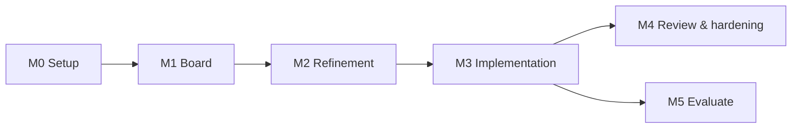

# AI-Driven PM System — Task Breakdown (v1)

_Version 1 · 2026-09-21 · Derived from `HLD.md` and `LLD.md` (section refs like §4 point into the LLD)_

The work is split into 6 milestones and 38 tasks. Each milestone ends with something you can use end to end. Tasks are sized for one person working part-time:

- **S**: up to half a day.
- **M**: about 1 day.
- **L**: 2–3 days.

The total is about 30–35 working days.

Every task has an ID, dependencies, the steps to do, and "Done when" acceptance criteria. The criteria are what you'd write in a PR description. In the step lists below, "RPC" means a remote procedure call through Supabase.

## Summary

Status: ✅ done · 🟡 partial, blocked on something named in the task · ⬜ not started.
Last updated 2026-09-21.

| ID | Status | Task | Milestone | Size | Depends on |
| --- | --- | --- | --- | --- | --- |
| T-001 | 🟡 | Prerequisites and accounts | M0 Setup | S | — |
| T-002 | ✅ | Monorepo scaffold | M0 Setup | S | T-001 |
| T-003 | ⬜ | Scratch target repo | M0 Setup | S | T-001 |
| T-004 | 🟡 | Local Supabase stack | M0 Setup | S | T-002 |
| T-101 | ✅ | Schema migration: enums, tables, indexes | M1 Board | M | T-004 |
| T-102 | ✅ | Triggers and RLS policies | M1 Board | M | T-101 |
| T-103 | ✅ | State machine: transitions seed, `transition_task`, `create_task` | M1 Board | M | T-101 |
| T-104 | ⬜ | pgTAP tests for schema, RLS, state machine | M1 Board | M | T-102, T-103 |
| T-105 | ✅ | `domain` package | M1 Board | S | T-002 |
| T-106 | ⬜ | `db` package | M1 Board | S | T-101, T-105 |
| T-107 | ⬜ | Auth: GitHub login | M1 Board | S | T-004, T-106 |
| T-108 | ⬜ | Task API route handlers | M1 Board | M | T-103, T-107 |
| T-109 | ⬜ | Board UI | M1 Board | L | T-108 |
| T-110 | ⬜ | Task detail page | M1 Board | M | T-108 |
| T-111 | ⬜ | Realtime updates | M1 Board | S | T-109, T-110 |
| T-112 | ⬜ | Settings and projects page | M1 Board | M | T-108 |
| T-201 | ⬜ | Queues, `enqueue_for_state`, queue RPC wrappers | M2 Refinement | M | T-103 |
| T-202 | ⬜ | `QueueWorker` and orchestrator bootstrap | M2 Refinement | M | T-201, T-106 |
| T-203 | 🟡 | GitHub App and `github` package | M2 Refinement | M | T-003, T-105 |
| T-204 | ⬜ | Project setup verifies App access | M2 Refinement | S | T-112, T-203 |
| T-205 | ⬜ | Agent run framework and run logging | M2 Refinement | M | T-202 |
| T-206 | ⬜ | Refinement agent | M2 Refinement | L | T-205, T-203 |
| T-207 | ⬜ | `handleRefine` job handler | M2 Refinement | M | T-206 |
| T-208 | ⬜ | Spec review UI | M2 Refinement | L | T-110, T-207 |
| T-209 | ⬜ | Run log viewer and cost display | M2 Refinement | S | T-205, T-111 |
| T-301 | ⬜ | Sandbox image and entrypoint | M3 Implementation | M | T-002 |
| T-302 | ⬜ | `sandbox` package | M3 Implementation | M | T-301 |
| T-303 | ⬜ | Implementation agent | M3 Implementation | L | T-205, T-301 |
| T-304 | ⬜ | `handleImplement` job handler | M3 Implementation | L | T-302, T-303, T-203 |
| T-305 | ⬜ | Webhook Edge Function | M3 Implementation | M | T-103, T-203 |
| T-306 | ⬜ | Budget guard | M3 Implementation | S | T-304 |
| T-307 | ⬜ | Sweeper, cancel, graceful shutdown | M3 Implementation | M | T-304 |
| T-401 | ⬜ | Review loop (`address_review`) | M4 Review & hardening | M | T-304, T-305 |
| T-402 | ⬜ | CI status badge | M4 Review & hardening | S | T-305 |
| T-403 | ⬜ | Sandbox egress proxy | M4 Review & hardening | M | T-302 |
| T-404 | ⬜ | Health endpoint and spend view | M4 Review & hardening | S | T-202, T-209 |
| T-501 | ⬜ | Agent eval set and harness | M5 Evaluate | M | T-304 |
| T-502 | ⬜ | Tune prompts and models, record decisions | M5 Evaluate | S | T-501 |

You can build T-301, T-302 and T-305 alongside M2 once T-103 and T-203 are done, since they don't depend on the refinement flow.

## Decisions to confirm before coding

- [x] Package manager and monorepo tool — pnpm 12 + turbo, decided in T-002.
- [x] Node and TypeScript — Node 24 LTS; TypeScript 6.0.3, not 7, because
      typescript-eslint refuses TS 7 until it ships 7.1 support.
- [ ] Refinement and implementation models, and the daily budget default.
      **Provisional**: `claude-sonnet-5` to refine, `claude-opus-5` to implement,
      $10/day, seeded by the T-102 trigger following the HLD's cheaper-to-refine
      rule. Editable from settings; T-502 tunes both from eval data. Confirm or
      change before M2 spends real money.
- [ ] Whether the refinement agent may use web search in v1. Due before T-206,
      which fixes the agent's tool allow-list.
- [ ] Whether the implementation agent may add new dependencies not listed in the
      approved spec (recommended: no). Due before T-206, not T-303: if the answer
      is no, the refinement prompt has to tell the agent that unlisted
      dependencies will be **blocked**, not merely discouraged. `domain`'s
      `allowedNewDependencies()` already reads the flag the hook will enforce.

---

## M0 — Setup

### T-001 Prerequisites and accounts · S

Install the local toolchain and create the external accounts the system depends on.

- [x] Install Node 22, pnpm 10, Docker Desktop (or Docker Engine) and the Supabase CLI.
- [ ] Create a hosted Supabase project and note its URL, anon key and service role key.
- [ ] Create an Anthropic API key with a monthly spend limit set in the console.
- [ ] Enable the GitHub OAuth provider in Supabase Auth, using a GitHub OAuth app whose callback is the Supabase auth URL.

> 🟡 Toolchain done: Node 24.21.0 (nvm), pnpm 12.5.1, Docker 29.5.2, Supabase CLI 2.117.0
> pinned as a repo devDependency rather than installed globally. Outstanding: hosted
> Supabase project, Anthropic API key, and the GitHub OAuth provider in Supabase Auth.
> Note this OAuth app is not the GitHub App from T-203 — they are separate.

**Done when**: `node -v`, `pnpm -v`, `docker run hello-world` and `supabase --version` all work, and the keys are stored in your password manager.

### T-002 Monorepo scaffold · S

Create the `pm-agent` repository with the layout from LLD §2.

- [x] Set up the pnpm workspace (`apps/*`, `packages/*`), `turbo.json` and `tsconfig.base.json` (strict).
- [x] Create `apps/web` with Next.js 16 (App Router), Tailwind v4 and shadcn/ui.
- [x] Add empty packages `domain`, `db`, `orchestrator`, `agents`, `github` and `sandbox`, each with `typecheck` and `test` scripts.
- [x] Add `.gitignore`, `.env.example` (LLD §11) and a README with setup steps.
- [x] Add CI: a GitHub Actions workflow running `pnpm typecheck` and `pnpm test` on push.

> ✅ Done. Deviations, each explained in its commit: Next 16 rather than 15,
> TypeScript 6.0.3 rather than 7 (typescript-eslint refuses TS 7), and the Supabase CLI
> as a devDependency. CI also runs lint and build, not just typecheck and test.

**Done when**: `pnpm install && pnpm typecheck && pnpm test` passes locally and in CI, and `pnpm dev` serves the default page on `localhost:3000`.

### T-003 Scratch target repo · S

Create a small throwaway repository that agents can safely work on.

- [ ] Create `pm-agent-playground`: a tiny TypeScript project with `pnpm test` (Vitest) and `pnpm lint`, plus one or two existing tests.
- [ ] Protect `main`: require a PR and one approving review, and block force pushes.

**Done when**: the repo exists, CI passes on `main`, and a direct push to `main` is rejected.

### T-004 Local Supabase stack · S

Run Supabase locally for development and testing.

- [x] Run `supabase init` in the monorepo, then `supabase start`.
- [x] Add scripts to the root `package.json`: `db:start`, `db:reset`, `db:test` and `db:types`.
- [ ] Link the hosted project with `supabase link`.
- [x] Add a `db:push` script (`supabase db push`) and document the rule in the README: a migration goes to the hosted project only after `db:reset` and `db:test` pass locally. Never edit the hosted schema in Studio.

> 🟡 Local stack running on 10 containers; analytics disabled because Vector could not
> reach the Docker socket on Windows and crash-looped. `supabase link` and `db:push`
> outstanding, both blocked on the hosted project from T-001.

**Done when**:

- `supabase start` prints local keys, and Studio opens at `localhost:54323`.
- `supabase db push --dry-run` connects to the linked hosted project.
- From T-101 onward, each migration task finishes with `pnpm db:push`, and `supabase migration list` shows local and remote in sync.

---

## M1 — Board

**Milestone exit criteria**:

- You can log in with GitHub, create a project and create tasks.
- You can see tasks on the board and move a task from Draft to Refining with a button.
- An illegal transition is rejected by the database.
- Every change appears live in a second browser tab.

### T-101 Schema migration: enums, tables, indexes · M

Write `supabase/migrations/0001_init.sql` following LLD §3.

- [x] Enable the `pgmq` extension (used in M2, enabled now so the migration is stable).
- [x] Create enums `task_state`, `run_kind`, `run_status` and `actor_kind`.
- [x] Create tables `projects`, `tasks`, `task_specs`, `comments`, `agent_runs`, `run_logs`, `task_events`, `github_events`, `settings` and `task_transitions`, with foreign keys and indexes as specified.
- [x] Create the private Storage bucket `runs`.
- [x] Add `tasks`, `task_specs`, `comments`, `agent_runs` and `run_logs` to the `supabase_realtime` publication.

> ✅ Done. 10 tables, 4 enums, 14 foreign keys, private `runs` bucket, 5 tables in the
> Realtime publication. Filename is `20260921120000_init.sql`, not `0001_init.sql`:
> the CLI requires a `<timestamp>_name.sql` pattern and silently skips anything else.

**Done when**: `supabase db reset` applies the migration cleanly, and the tables appear in Studio.

### T-102 Triggers and RLS policies · M

Protect the data with row-level security (RLS) and trigger guards.

- [x] Add a `tasks_updated_at` trigger.
- [x] Add a `tasks_guard_state` trigger that blocks changes to `state`, `approved_spec_id`, `locked_by`, `locked_at` and `pr_number` unless `app.transition = 'on'`.
- [x] Add a trigger that rejects new `task_specs` rows once the task is in `ready_to_pull` or later.
- [x] Add an `on_auth_user_created` trigger that inserts a `settings` row with default models and budget.
- [x] Enable RLS on every table:
    - `projects`, `tasks` and `settings` use owner policies.
    - Child tables (`task_specs`, `comments`, `agent_runs`, `run_logs`, `task_events`) allow select through the owning task.
    - `comments` allows the user to insert with `author = 'user'`.
    - `github_events` and `task_transitions` have no user write policy.
- [x] Make the `tasks` insert policy require `state = 'draft'`.
- [x] Add Storage policies on `storage.objects` for the private `runs` bucket. Object names are `<run_id>/<file>`.
    - `select` for `authenticated`: allowed when `bucket_id = 'runs'` and the first path segment is the id of an `agent_runs` row on one of the user's own tasks.
    - No `insert`, `update` or `delete` policies. Only the service role (the orchestrator) writes run artifacts.

> ✅ Done. Verified by hand: direct state change and lock grab rejected while a title
> edit succeeds; spec insert rejected once `ready_to_pull`; user B sees none of user A's
> rows or transcripts. T-104 turns these checks into pgTAP so they run in CI.

**Done when**:

- As an authenticated user you can only see your own rows, and a direct `update tasks set state = 'done'` fails.
- A user can download a transcript for their own run. A request for another user's run, and any upload with the user's key, are denied.

### T-103 State machine: transitions seed, `transition_task`, `create_task` · M

Implement the core state-machine functions from LLD §4.

- [x] Seed `task_transitions` with the 14 concrete rows from LLD §4. The "any except done → cancelled" line is a wildcard and gets no row: `transition_task` handles it as a special case.
- [x] Implement `transition_task`:
    - Row lock, actor checks (a user acts only on their own tasks; any other actor needs the service role).
    - Allowed-transition lookup, plus the `cancelled` rule.
    - Approval guard (`current_spec_id` must exist and match `expected_spec_id`).
    - Patch whitelist, lock handling and the `task_events` insert.
    - Call `enqueue_for_state`. Stub it as a no-op for now; T-201 implements it.
- [x] Implement `create_task`: lock the project row, allocate the key, increment `next_task_number` and insert the draft.
- [x] Set grants: revoke from `public` and `anon`, grant to `authenticated` and `service_role`.

> ✅ Done. Verified end to end against the local stack: create_task allocates PM-1
> then PM-2, draft → refining succeeds and draft → done raises P0001. A browser user
> passing actor 'agent' is refused with 42501, a stale expected_spec_id raises P0002,
> and the full path draft → refining → awaiting_approval → ready_to_pull → in_progress
> → in_review → done leaves a complete task_events trail. enqueue_for_state is a
> declared no-op until T-201.

**Done when**: calling the functions over RPC as a user creates `PM-1`, moves it `draft → refining`, and rejects `draft → done` with error code `P0001`.

### T-104 pgTAP tests for schema, RLS, state machine · M

Write database tests in `supabase/tests/`.

- [ ] Test every legal transition for its allowed actor(s), and a sample of illegal ones (wrong actor, wrong state).
- [ ] Test the cancel rule: a user can cancel from every state except `done` and `cancelled`, and a non-user actor can't cancel.
- [ ] Test that the approval guard rejects a stale `expected_spec_id` with `P0002`.
- [ ] Test that the guard trigger blocks direct state updates.
- [ ] Test RLS: user A cannot read or modify user B's projects or tasks, and cannot read objects under B's run ids in the `runs` bucket.
- [ ] Test that `create_task` produces sequential keys under two concurrent calls.
- [ ] Test that `task_events` gets exactly one row per transition.

**Done when**: `supabase test db` is green, and CI runs it (the workflow starts a local Supabase in CI).

### T-105 `domain` package · S

Create the shared, dependency-free domain types.

- [x] Add `states.ts`: `TaskState`, `ActorKind` and a `TRANSITIONS` array mirroring the 14 seed rows, with helpers `canTransition(from, to, actor)` and `userActions(state)`. Both helpers apply the cancel rule in code, the same way `transition_task` does.
- [x] Add `jobs.ts`: the `JobMessage` Zod union (LLD §5).
- [x] Add `spec.ts`: the `RefinementOutput` Zod schema (LLD §7.1) and the `ImplementationResult` schema for `result.json`.
- [x] Add `env.ts`: a Zod schema for the environment variables (LLD §11), with separate server and browser subsets.
- [x] Add a Vitest parity test that extracts the `task_transitions` seed from the migration file and compares it to `TRANSITIONS`.

> ✅ Done. All four modules, 44 tests. The parity test reads the seed out of the
> migration and was verified to fail when the two copies diverge, not merely to pass.

**Done when**: `pnpm --filter @pm/domain test` passes, and changing either copy of the transitions makes the parity test fail.

### T-106 `db` package · S

Create the typed database access layer.

- [ ] Generate `database.types.ts` with `supabase gen types typescript --local`.
- [ ] Add typed helper functions: `transitionTask()`, `createTask()`, `getTaskByKey()`, `listBoard(projectId)`.
- [ ] Add a service-role client factory for server-only use, and guard it against being imported by browser code.

**Done when**: the web app can import `@pm/db` and call `listBoard` with full type inference.

### T-107 Auth: GitHub login · S

Add GitHub sign-in through Supabase Auth.

- [ ] Add `lib/supabase/server.ts` and `browser.ts` using `@supabase/ssr`.
- [ ] Add a `middleware.ts` that refreshes the session and redirects unauthenticated users to `/login`.
- [ ] Add a `/login` page with a "Sign in with GitHub" button, and an `/auth/callback` route handler.
- [ ] Add a sign-out action in the header.

**Done when**: you can sign in and out locally, and a `settings` row exists for your user after the first login.

### T-108 Task API route handlers · M

Implement the task routes from LLD §10. Each route follows the same pattern: validate the body with Zod, call an RPC as the user, and map errors to HTTP codes.

- [ ] `POST /api/tasks` creates a task through `create_task`.
- [ ] `PATCH /api/tasks/:key` edits fields, only while the task is in `draft`, `awaiting_approval` or `blocked`.
- [ ] Add the transition routes: `refine`, `approve`, `request-changes`, `unblock` and `cancel`. `request-changes` and `unblock` also insert a comment.
- [ ] `PATCH /api/tasks/:key/position` reorders within a column.
- [ ] Add shared error mapping: `P0001` and `P0002` → 409, `42501` → 403, Zod errors → 400.

**Done when**: each route has a Vitest integration test against local Supabase covering success and one failure case.

### T-109 Board UI · L

Build the Kanban board at `/`.

- [ ] Add a project selector (the last-used project is remembered).
- [ ] Show 8 columns in state order. Cancelled tasks are hidden behind a toggle.
- [ ] Each card shows the key, title, priority, labels, estimate (once a spec exists) and a run spinner.
- [ ] Add a "New task" dialog with title, description (markdown), priority and labels.
- [ ] Support drag to reorder within a column (dnd-kit). Dragging never changes state.
- [ ] Add an action button on each card that comes from `userActions(state)`.
- [ ] Add empty states and loading skeletons.

**Done when**: you can create 5 tasks, reorder them, and refine one from the board. The order survives a reload.

### T-110 Task detail page · M

Build the task page at `/tasks/[key]`.

- [ ] Show the header with key, title, state badge and action buttons.
- [ ] Add a description editor (markdown), editable only in editable states.
- [ ] Add a comments list and a comment box.
- [ ] Show the event history (`task_events`) as a timeline.
- [ ] Add placeholder tabs for Spec and Runs (filled in M2).

**Done when**: all user transitions available in the current state can be triggered from this page, and the timeline reflects them.

### T-111 Realtime updates · S

Keep open pages live without polling.

- [ ] Subscribe to `tasks` changes for the current project on the board.
- [ ] Subscribe to `tasks`, `comments` and `task_events` changes for the current task on the detail page.
- [ ] Invalidate the TanStack Query caches on each event, and clean up subscriptions on unmount.

**Done when**: a change made in one tab appears in another within about 1 second.

### T-112 Settings and projects page · M

Build `/settings`.

- [ ] Add a projects list plus a create/edit form: name, key prefix, repo owner/name, default branch, setup commands and test commands.
- [ ] Add a settings form: daily budget, refinement model, implementation model and implementation concurrency (fixed at 1 in v1, shown read-only).
- [ ] Add a `POST /api/projects` route. The installation check is added in T-204.

**Done when**: you can create a project for `pm-agent-playground` and edit its commands.

---

## M2 — Refinement

**Milestone exit criteria**:

- Clicking Refine produces a validated spec (v1) within a few minutes.
- You can comment and re-refine to get v2, and see the diff between v1 and v2.
- Approving moves the task to Ready to Pull, pinned to the exact spec version you approved.
- Every run shows its live logs and cost.

### T-201 Queues, `enqueue_for_state`, queue RPC wrappers · M

Add the job queues to the database (LLD §5).

- [ ] Add migration `0002_queues.sql`: create the queues `q_refine`, `q_implement`, `q_refine_dlq` and `q_implement_dlq`.
- [ ] Implement `enqueue_for_state(t, p_from, p_patch)` (LLD §4) to replace the stub.
- [ ] Add the wrappers `queue_read`, `queue_archive`, `queue_set_vt` and `queue_send`, as `security definer` functions executable only by `service_role`.
- [ ] Add pgTAP tests: each enqueuing transition produces exactly one message of the correct type, and the wrappers are denied to `authenticated`.

**Done when**: a `draft → refining` transition puts a `refine` message on `q_refine`, visible with `queue_read`.

### T-202 `QueueWorker` and orchestrator bootstrap · M

Build the worker loop that consumes the queues.

- [ ] Implement `QueueWorker`:
    - Poll loop (3 s when idle, immediately after a job).
    - Concurrency semaphore.
    - Zod-parse each message; malformed messages go to the DLQ.
    - Retry by visibility timeout, and move to the DLQ plus a `blocked` transition after `maxAttempts`.
    - Optional heartbeat that extends the visibility timeout.
    - `stop()` that drains in-flight jobs.
- [ ] Implement `startOrchestrator(deps, cfg)` with handler registration.
- [ ] Start the orchestrator from `apps/web/instrumentation.ts` only when `ORCHESTRATOR_ENABLED=true` and the runtime is `nodejs`, behind a `globalThis` singleton.
- [ ] Add a structured logger (pino) with `runId` and `taskKey` fields.

**Done when**:

- Unit tests with a fake database cover success, retry, the DLQ path and the heartbeat.
- In dev mode, hot reload doesn't start a second worker.

### T-203 GitHub App and `github` package · M

Set up GitHub access for the agents.

- [x] Create a private GitHub App with the permissions and events from LLD §9. Leave the webhook URL empty until T-305.
- [ ] Install the App on `pm-agent-playground`.
- [ ] Implement `installationToken(installationId, repo, access)`.
- [ ] Add an Octokit client factory.
- [ ] Add a `shallowClone(repo, token, dir)` helper that clones with the token and never writes it to disk or logs.
- [ ] Add PR helpers: `openPullRequest` and `getReviewComments`.

> 🟡 Private GitHub App created and its credentials verified (App ID numeric, private key
> decodes to a valid 2048-bit RSA key). Everything else outstanding, and installing the
> App needs the playground repo from T-003, which does not exist yet.

**Done when**: a script mints a token and clones the playground repo, and a test confirms the token string never appears in logs.

### T-204 Project setup verifies App access · S

Check GitHub access when a project is created or edited.

- [ ] In `POST /api/projects`, look up the App installation for the repo, store `github_installation_id`, and reject with a clear message if the App isn't installed there.
- [ ] Show an "Install GitHub App" link in settings when the installation is missing.

**Done when**: creating a project for a repo without the App fails with the install link, and succeeds after installing it.

### T-205 Agent run framework and run logging · M

Build the shared plumbing every agent run uses (LLD §7).

- [ ] Add the `RunContext`, `AgentEvent`, `AgentResult` and `AgentRunner` types.
- [ ] Add a run recorder in the orchestrator:
    - Create and update `agent_runs`.
    - Batch `run_logs` inserts with an increasing `seq`, flushing every 500 ms.
    - Upload the transcript to the `runs` bucket as `<run_id>/transcript.jsonl`.
    - Compute `cost_usd` from the `model_prices` map.
- [ ] Load versioned prompts from `packages/agents/prompts/*.vN.md`, and record `prompt_version` on each run.
- [ ] Wire an `AbortSignal` into every run.

**Done when**: a fake agent run produces an `agent_runs` row, ordered logs and a transcript file, with the cost computed.

### T-206 Refinement agent · L

Implement the read-only agent that turns a task into a spec (LLD §7.1).

- [ ] Write the `refine.v1.md` prompt. It must cover the role, how to explore the repo, what to put in each output field, when to raise open questions, and "return only JSON".
- [ ] Run it with the Claude Agent SDK, allowing only the tools `Read`, `Glob`, `Grep`, `WebSearch` and `WebFetch`, with the working directory set to the temp clone.
- [ ] Build the input: task text, repo tree (3 levels), README, manifest files, previous spec and unresolved comments.
- [ ] Validate the output with `RefinementOutput`. If it fails, send one corrective turn containing the Zod error, then fail the run.
- [ ] Enforce the budget: max turns, max cost and timeout (LLD §7.2 table).

**Done when**: on three sample tasks in the playground repo, the agent returns valid specs under $0.50 each.

### T-207 `handleRefine` job handler · M

Connect the refinement agent to the queue (LLD §6, `handleRefine` steps 1–7).

- [ ] Guard on `state = refining`.
- [ ] Create the run, clone the repo and run the agent.
- [ ] On success, insert `task_specs` (next version) and transition to `awaiting_approval` with `current_spec_id`.
- [ ] On final failure, transition to `blocked` with a reason.
- [ ] Always clean up the temp dir and archive the message.

**Done when**:

- An end-to-end test with a fake agent and local Supabase moves a task `refining → awaiting_approval` with spec v1.
- A redelivered message is a no-op.

### T-208 Spec review UI · L

Build the Spec tab on the task detail page.

- [ ] Render `RefinementOutput`:
    - Summary, a checklist of acceptance criteria, and the approach (markdown).
    - A tech suggestions table with a "new dependency" flag.
    - Affected files, test plan, risks, and open questions highlighted.
- [ ] Add a version switcher and a diff view between any two versions (`jsdiff` on a normalized text rendering).
- [ ] Support inline comments tied to `spec_id`, marking them resolved, and include unresolved comments in the next refinement input.
- [ ] Add an Approve button that sends `specId` (409 → "spec changed, reload") and a Request changes button that requires a comment.

**Done when**: you can go v1 → comment → v2 → diff → approve, and the task shows the pinned `approved_spec_id`.

### T-209 Run log viewer and cost display · S

Build the Runs tab on the task detail page.

- [ ] List the task's runs with kind, status, duration, tokens and cost.
- [ ] Stream the selected run's logs live over Realtime (`run_logs`).
- [ ] Show tool calls as collapsible rows.
- [ ] Add a transcript download link through `GET /api/runs/:id/transcript` (signed URL).
- [ ] Show the total cost for the task on its board card.

**Done when**: during a refinement run the logs stream live, and the cost appears when the run finishes.

---

## M3 — Implementation

**Milestone exit criteria**:

- Approving a spec on the playground repo leads to a branch and a PR within about 40 minutes, with no further clicks.
- The PR body lists the acceptance criteria.
- Merging the PR moves the task to Done.
- A failed run leaves the task Blocked with a readable reason.
- No containers are left running afterwards.

### T-301 Sandbox image and entrypoint · M

Build the Docker image the implementation agent runs in (LLD §8).

- [ ] Write `sandbox-image/Dockerfile`.
- [ ] Write `sandbox-image/entrypoint/`, a Node script that:
    - Reads the task and spec from `/workspace/.agent/input.json`.
    - Runs the Agent SDK with the allowed tools and the permission hook (T-303).
    - Writes JSON events line by line to stdout.
    - Exits with 0 when done, 2 when blocked, and 1 on error.
- [ ] Add a `pnpm sandbox:build` script that tags the image `pm-agent-sandbox:<version>`.

**Done when**: `docker run` with a dummy input prints JSON events and exits, as the `agent` user with a read-only root filesystem.

### T-302 `sandbox` package · M

Manage sandbox containers from Node (LLD §8).

- [ ] Implement `SandboxManager.create` with dockerode, applying the limits from LLD §8:
    - Resources: 2 CPUs, 4 GB memory, 512 PIDs.
    - Read-only root filesystem, with a tmpfs `/tmp`.
    - All capabilities dropped and `no-new-privileges` set.
    - A dedicated network and labels.
- [ ] Implement `Sandbox.exec` with line streaming, a timeout and exit-code capture.
- [ ] Implement `readFile` and `destroy`.
- [ ] Implement `cleanupOrphans(maxAgeMin)`, which finds containers by label.

**Done when**: an integration test creates a container, runs `git --version`, reads a file and destroys it, and a second test confirms `cleanupOrphans` removes a stale container.

### T-303 Implementation agent · L

Implement the agent that writes code inside the sandbox (LLD §7.2).

- [ ] Write the `implement.v1.md` prompt. It must cover:
    - The approved spec as a checklist.
    - The setup and test commands.
    - Commit in small steps and never push.
    - Write `result.json` with `status`, `summary` and `checklist`.
    - Use `blocked` plus a `question` when it can't proceed.
- [ ] Write a permission hook that denies:
    - Writes under `.github/` and to `.env*`.
    - Lockfile changes unless the spec lists a new dependency.
    - Any `git push`.
    - Destructive commands outside `/workspace`.
- [ ] Add an `ImplementationAgent` runner that prepares `input.json`, execs the entrypoint, maps stdout events to `AgentEvent`, and parses `result.json` with `ImplementationResult`.

**Done when**:

- On a small playground task (for example "add a `slugify` util with tests"), the agent commits working code, and `result.json` marks all criteria met.
- A test shows the hook blocks a write to `.github/workflows/x.yml`.

### T-304 `handleImplement` job handler · L

Connect the implementation agent to the queue (LLD §6, `handleImplement` steps 1–9).

- [ ] Add the guard, then claim with the `branch` and `locked_by` patch.
- [ ] Create the run and mint a write token.
- [ ] Create the sandbox, clone, check out the branch and run the setup commands.
- [ ] Run the agent.
- [ ] Run the final gate: `test_commands` run by the orchestrator. If a test fails, the run is marked failed and the task goes to `blocked`, with the test output uploaded.
- [ ] Push the branch and open the PR (title and body format from LLD §9).
- [ ] If no webhook arrives within 30 s, do the fallback `in_review` transition.
- [ ] Always destroy the container, finalize the run and archive the message.
- [ ] Heartbeat the visibility timeout every 2 minutes.

**Done when**: an end-to-end run on the playground repo produces a PR, and the task reaches `in_review`. Test with a fake agent in CI and the real agent manually.

### T-305 Webhook Edge Function · M

Receive GitHub events in Supabase (LLD §9).

- [ ] Write `supabase/functions/github-webhook/index.ts`:
    - Verify the HMAC signature with a constant-time compare.
    - Insert into `github_events` with dedupe on `delivery_id`.
    - Map the event to a task using the branch prefix, falling back to the PR number.
    - Call `transition_task` through the service role, following the LLD §9 table.
    - Set `processed_at` or `error`.
- [ ] Store GitHub payload fixtures for opened, review changes_requested, closed merged, closed unmerged and check_suite.
- [ ] Add a test script that replays the fixtures against `supabase functions serve`.
- [ ] Deploy with `--no-verify-jwt`, set `GITHUB_WEBHOOK_SECRET`, and set the App's webhook URL.

**Done when**:

- The fixtures drive the expected transitions.
- A duplicate delivery is a no-op, and a bad signature returns 401.
- A real PR merge on the playground repo moves the task to Done.

### T-306 Budget guard · S

Stop runs from exceeding the daily spend cap.

- [ ] Before claiming a run, compute today's spend (in the local timezone) plus the run's max cost, and compare it with `daily_budget_usd`.
- [ ] If over budget, delay the message to the next midnight with `queue_set_vt`, and add a system comment on the task saying so.
- [ ] Show today's spend against the budget in the app header.

**Done when**: with the budget set to $0.01, approving a spec leaves the task in Ready to Pull with an explanatory comment, and no run starts.

### T-307 Sweeper, cancel, graceful shutdown · M

Recover from crashes and support cancelling (LLD §6).

- [ ] Add a sweeper that runs every 60 s and:
    - Returns stale `in_progress` locks to `ready_to_pull` (a `system` transition).
    - Marks stuck runs as `failed`.
    - Removes orphaned containers.
- [ ] Support cancel: keep an `AbortController` per active task, subscribe to `tasks` Realtime for `cancelled`, then abort, destroy the container and mark the run `cancelled`.
- [ ] On SIGTERM, stop polling, wait up to 30 s, then exit.

**Done when**:

- Killing the Next.js process mid-run and restarting it re-runs the task after the lock expires.
- Cancelling mid-run stops the container within about 5 s.

---

## M4 — Review loop and hardening

**Milestone exit criteria**:

- Requesting changes on a PR makes the agent push follow-up commits to the same branch.
- CI status shows on the card.
- The sandbox can reach only the allow-listed domains.

### T-401 Review loop (`address_review`) · M

Let the agent respond to your PR review.

- [ ] In the webhook, a `changes_requested` review triggers the `in_review → in_progress` transition with `review_id`, which enqueues `address_review`.
- [ ] Add `handleAddressReview`:
    - Fetch the review comments.
    - Create a sandbox on the existing branch and run the agent with an "address only these comments" prompt (`address_review.v1.md`).
    - Run the test gate and push.
    - Transition back to `in_review` through the agent fallback.
- [ ] Post a PR comment summarizing what changed.

**Done when**: a "rename this function" review on the playground PR results in a new commit on the same branch, and the task returns to In Review.

### T-402 CI status badge · S

Show GitHub CI results on the board.

- [ ] In the webhook, store the `check_suite.completed` conclusion in `agent_runs.ci_conclusion` for the latest run on the task.
- [ ] Show the badge (pending, passed or failed) on the card and the detail page, linking to the checks page.

**Done when**: a failing CI run on an agent PR shows a red badge within about 1 minute.

### T-403 Sandbox egress proxy · M

Restrict the sandbox's network access.

- [ ] Add a proxy container (tinyproxy or Squid) with the domain allow-list from LLD §8, on the sandbox network. The sandbox gets no other route out.
- [ ] Set `HTTPS_PROXY` and `HTTP_PROXY` in the sandbox, and configure npm, pip and git to use them.
- [ ] Start and health-check the proxy together with the orchestrator.

**Done when**: from inside a sandbox, `curl https://api.github.com` works and `curl https://example.com` fails.

### T-404 Health endpoint and spend view · S

Add basic monitoring.

- [ ] Add `GET /api/health` returning the orchestrator state, queue depths (including the DLQs), running containers and today's spend.
- [ ] Add a spend view in settings: cost per day for the last 30 days, runs per day and success rate.

**Done when**: `/api/health` reflects a running job, and the spend view matches the sum of `agent_runs.cost_usd`.

---

## M5 — Evaluate and tune

**Milestone exit criteria**: you know the success rate and average cost per task for the current prompts and models, and your default settings are chosen from that data.

### T-501 Agent eval set and harness · M

Measure how well the agents perform.

- [ ] Write 5–10 representative tasks for the playground repo, each with a hidden check such as an extra test that must pass after the agent's change.
- [ ] Add a harness script that:
    - Runs refine and implement for each task, auto-approving the spec.
    - Collects pass/fail, cost, duration and turns.
    - Writes a markdown report.

**Done when**: one command produces a report comparing two prompt versions or models.

### T-502 Tune prompts and models, record decisions · S

Use the eval results to choose defaults.

- [ ] Iterate on `refine` and `implement` prompts, and on model choice, based on the eval report.
- [ ] Decide:
    - The default models and the daily budget.
    - Whether to raise implementation concurrency above 1.
    - Whether and when to move the orchestrator off your computer.
- [ ] Record the decisions in `docs/decisions.md` (one short ADR each).

**Done when**: the defaults in `settings` match the recorded decisions, and the eval pass rate is written down as the v1 baseline.
